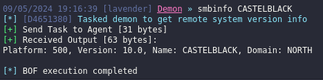
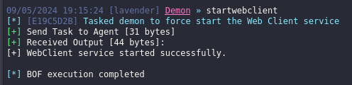

# BofCollection
BOFs gift wrapped for Havoc

## [C2 Tools Collection](https://github.com/outflanknl/C2-Tool-Collection)

- [PetitPotam](https://github.com/outflanknl/C2-Tool-Collection/tree/main/BOF/PetitPotam)
> Perform an attack which abuses MS-EFSRPC - Escalate privileges from Domain User to Domain Admin

>[!warning]
>Currently crashes and kills your beacon

- [Smbinfo](https://github.com/outflanknl/C2-Tool-Collection/tree/main/BOF/Smbinfo)
> Gather remote system version information

- [StartWebClient](https://github.com/outflanknl/C2-Tool-Collection/tree/main/BOF/StartWebClient)
> Force the Web client service to be started - useful to perform further attacks (such as PetitPotam)

